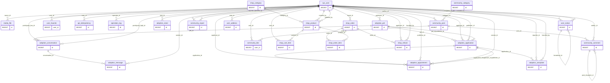

# ER 关系

以下仅画物理外键；头像业务绑定、收藏、举报、JSON 进度和已读位置另由 Service 校验。

```mermaid
erDiagram
    sys_user {
        BIGINT id
    }
    media_file {
        BIGINT id
    }
    user_notice {
        BIGINT id
    }
    user_favorite {
        BIGINT user_id
    }
    api_idempotency {
        BIGINT id
    }
    operation_log {
        BIGINT id
    }
    adoption_pet {
        BIGINT id
    }
    adoption_need {
        BIGINT id
    }
    adoption_application {
        BIGINT id
    }
    adoption_conversation {
        BIGINT id
    }
    adoption_message {
        BIGINT id
    }
    adoption_appointment {
        BIGINT id
    }
    adoption_complaint {
        BIGINT id
    }
    community_category {
        BIGINT id
    }
    community_post {
        BIGINT id
    }
    community_comment {
        BIGINT id
    }
    community_like {
        BIGINT user_id
    }
    community_report {
        BIGINT id
    }
    shop_category {
        BIGINT id
    }
    shop_product {
        BIGINT id
    }
    shop_cart_item {
        BIGINT id
    }
    user_address {
        BIGINT id
    }
    shop_order {
        BIGINT id
    }
    shop_order_item {
        BIGINT id
    }
    shop_refund {
        BIGINT id
    }
    sys_user ||--o{ media_file : "owner_id"
    sys_user ||--o{ user_notice : "recipient_id"
    user_notice ||--o{ user_notice : "broadcast_id"
    sys_user ||--o{ user_notice : "created_by"
    sys_user ||--o{ user_favorite : "user_id"
    sys_user ||--o{ api_idempotency : "user_id"
    sys_user ||--o{ operation_log : "operator_id"
    sys_user ||--o{ adoption_pet : "publisher_id"
    sys_user ||--o{ adoption_need : "user_id"
    adoption_pet ||--o{ adoption_application : "pet_id"
    sys_user ||--o{ adoption_application : "applicant_id"
    sys_user ||--o{ adoption_application : "publisher_id"
    adoption_pet ||--o{ adoption_application : "pet_id,publisher_id"
    adoption_pet ||--o{ adoption_conversation : "pet_id"
    sys_user ||--o{ adoption_conversation : "participant_low_id"
    sys_user ||--o{ adoption_conversation : "participant_high_id"
    adoption_conversation ||--o{ adoption_message : "conversation_id"
    sys_user ||--o{ adoption_message : "sender_id"
    adoption_application ||--o{ adoption_appointment : "application_id"
    sys_user ||--o{ adoption_appointment : "applicant_id"
    sys_user ||--o{ adoption_appointment : "publisher_id"
    sys_user ||--o{ adoption_appointment : "creator_id"
    adoption_application ||--o{ adoption_appointment : "application_id,applicant_id,publisher_id"
    adoption_application ||--o{ adoption_complaint : "application_id"
    sys_user ||--o{ adoption_complaint : "reporter_id"
    sys_user ||--o{ adoption_complaint : "handled_by"
    sys_user ||--o{ community_post : "author_id"
    community_category ||--o{ community_post : "category_id"
    community_post ||--o{ community_comment : "post_id"
    sys_user ||--o{ community_comment : "author_id"
    community_comment ||--o{ community_comment : "parent_id"
    community_comment ||--o{ community_comment : "post_id,parent_id"
    sys_user ||--o{ community_like : "user_id"
    community_post ||--o{ community_like : "post_id"
    sys_user ||--o{ community_report : "reporter_id"
    sys_user ||--o{ community_report : "handled_by"
    shop_category ||--o{ shop_product : "category_id"
    sys_user ||--o{ shop_product : "created_by"
    sys_user ||--o{ shop_product : "updated_by"
    sys_user ||--o{ shop_cart_item : "user_id"
    shop_product ||--o{ shop_cart_item : "product_id"
    sys_user ||--o{ user_address : "user_id"
    sys_user ||--o{ shop_order : "buyer_id"
    shop_order ||--o{ shop_order_item : "order_id"
    shop_product ||--o{ shop_order_item : "product_id"
    shop_order ||--o{ shop_refund : "order_id"
    sys_user ||--o{ shop_refund : "applicant_id"
    sys_user ||--o{ shop_refund : "handled_by"
```
